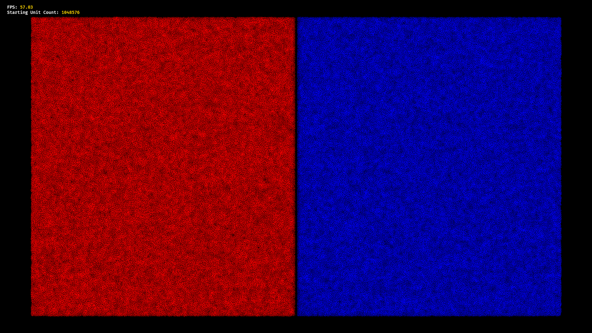

# Realtime Large Scale Battle Simulator with GPU Compute Shaders inside of Bevy
[**Youtube Video and Explanation**]()



Description
============
A GPU accelerated battle simulator which heavily utilizes compute shaders to simulate upwards of 2 million units in realtime. The simulation is advanced enough for the units to actually kill each other and can be run at a stable 60 fps with 1 million units on my machine.

Features/Optimizations
=============
* **Compute Shaders:** This simulation uses WebGPU Compute Shaders written in the WGSL Shader language to update the actual logic of the game resulting in the ability to handle millions of units stably and with minimal lag due to both the heavy performance gains of using a GPU as well as the inherent parallelism of Compute shader and hardware accelerated code.
* **Spatial Hashing:** To reduce excess calculations between units which are in reality very far away, a grid based spatial hashing algorithm is utilized to divide units into spatial bins which limit the checks that they perform to a 3x3 enclosure of grids surrounding the grid which a unit has been partitioned into
* **Bitonic Sort:** This simulation implements a parallelized and iterative approach to bitonic merge sort to create a sorting network that arranges units on hardware with compute shaders so that they are partitioned adjacent to each other in a storage buffer, allowing for spatial hashing to be more easily implemented
* **Timestep Interpolation:** In order to further increase the total framerate of the simulation, I've added perhaps the unecessary optimization of running the game at a fixed timestep which should in most cases be lower than the refresh rate of the device. The simulation is still smoothed through interpolation using an accumulator value when rendering the units so they appear to have smooth movement. Smoothness is the end goal of this project regardless of any misgivings about the real physics timestep of the system. Feel free to modify the code to remove this feature if you dislike its "pretentiousness"

Usage
=====
This project currently uses Bevy Version 0.15 and can easily be run from the command line
```
cargo run
```
